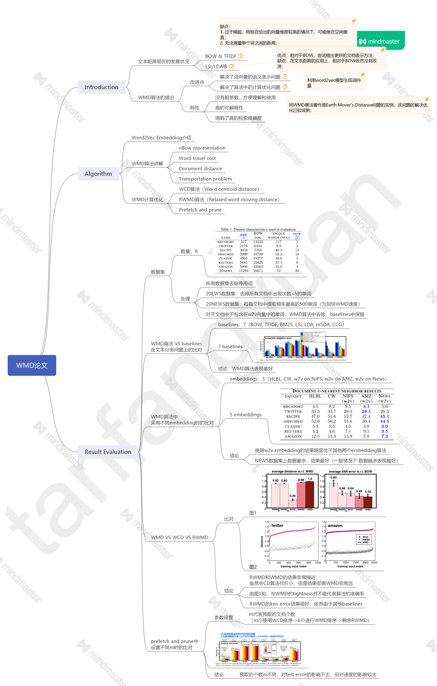
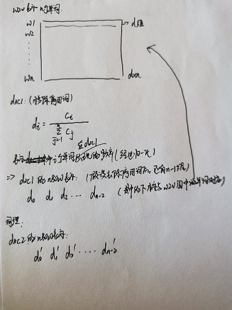
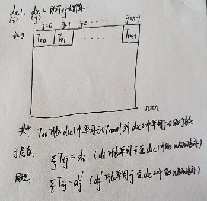
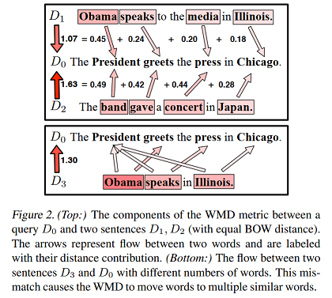
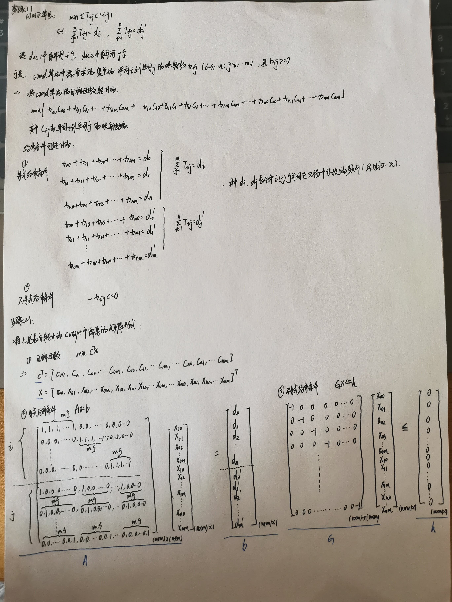

&emsp;&emsp;本文对《From Word Embeddings to Document Distances》论文（以下简称“WMD论文”）进行了讲解，并对其代码实现进行了介绍。  

## 1. 论文讲解
&emsp;&emsp;在WMD论文中，作者提出了Word Mover's Distance算法用来计算文档之间的距离，该算法基于word embedding来表示句子中的词向量。同时作者将文本距离计算问题看作是the Earth Mover's Distance问题的一个实例，并提出了多种计算优化方法。以下是整个论文的框架，以及对WMD及其计算优化的详细讲解。
<!--more-->  

### 1.1 论文框架
&emsp;&emsp;本论文具体框架如下所示，其中的Algorithm讲解请见下方1.2小节：  
<center></center>  
<center><b><font face="黑体" size=2>图1 WMD论文框架</font></b></center>  

### 1.2 算法详解  

#### 1.2.1 Word2Vec Embedding介绍
&emsp;&emsp;Mikolov提出word2vec模型，该模型为无监督模型，使用神经网络语言模型生成词向量。在word2vec的skip-gram模型中，根据上下文词训练得到概率最大的中心词词向量，具体的公式如下：  
$$\frac 1T\sum_{t=1}^T\sum_{j\in nb(t)}{\log p(w_j|w_t)}\tag{1}$$
其中nb(t)代表word$w_j$的上下文词。由于skip-gram模型简单的架构以及其中hierarchical softmax的应用，使得该模型可以在单机上每小时训练上亿单词。  

#### 1.2.2 WMD算法讲解
&emsp;&emsp;下面我们将详细讲解WMD算法的实现逻辑。  

* __nBow Representation__  
该算法首先将文档用nBOW向量$d\in R^n$表示，其中的每个元素代表对应的单词$i_{th}$在该文档中出现的次数（经过归一化处理），具体如下：  
<center></center>  
<center><b><font face="黑体" size=2>图2 文档的nBOW表示</font></b></center>  
  
* __Word Travel Cost__  
本论文的目标是在文本距离的计算过程中加入单词对之间的语义相似度，衡量单词语义相似度的其中一种方法是使用它们各自在w2v embedding向量空间中的欧式距离来表示，即为：  
$$c(i, j) = \rVert x_i - x_j \rVert_2\tag{2}$$
$c(i, j)$即表示两个word之间的“travel cost”。  
  
* __Document Distance__  
基于上述nBow representation和word之间的travel cost，对于两篇文档doc1、doc2，设其nBow representation分别为$d$和$d'$，doc1中的单词$i$ Travel到doc2中的单词$j$的个数为$T_{ij}$，两个单词的$travel cost=c(i, j)$，于是有：<center></center>  
<center><b><font face="黑体" size=2>图3 两文档映射的矩阵表示</font></b></center>  
综上，可以得知doc1和doc2之间的文本距离可表示为：  
$$\sum_{i,j}T_{i,j}c(i, j)\tag{3}$$
  
* __Transportation Problem__  
根据Document Distance中得到的文本距离公式，可以知道WMD算法需要解决的问题可表示为：  
$$min_{T\geq 0}\sum_{i,j=1}^n{T_{ij}c(i, j)}\tag{4}$$
$$\begin{aligned}subject\ to: \sum_{j=1}^n{T_{ij} = d_i} \quad \forall i\in \{1,...,n\} \\\qquad \qquad \quad \sum_{i=1}^n{T_{ij} = d'_j} \quad \forall j\in \{1,...,n\}\end{aligned}$$
上述优化问题可以看作是the Earth Mover's Distance（EMD）问题的一个实例，EMD问题是一个研究很透彻的运输问题，已经有很成熟的解法。 
  
* __Visualization__  
最后以下图中几个句子为例，对WMD算法进行可视化总结：  
<center></center>  
<center><b><font face="黑体" size=2>图4 WMD算法举例</font></b></center>  

Top图中句子$D_1$和$D_2$分别和$D_0$计算文本距离，首先对各句子去除停用词，发现$D_1$和$D_2$ 与 $D_0$之间的BOW/TF-IDF距离都是相同的。但是在图中WMD算法中，我们观察到，各句子之间的word travel都在希望的语义相似的单词之间进行，进而得到最终的文本距离。  

#### 1.2.3 WMD计算优化
&emsp;&emsp;WMD的最好平均时间复杂度为$O(p^3\log p)$（p表示一篇文档中出现的不重复单词个数），对于文章中含有大量不重复单词或者文章数量众多的情况，wmd算法的代价太高。以下我们介绍几种利用求取WMD的lower bounds进行优化的算法：WCD & RWMD。  

* __Word Centroid Distance__  

>【向量范数定义】  
>如果向量 x∈Rn 的某个实值函数f(x)=||x||满足：  
>1. 正定性： ||x||≥0，且||x||=0当且仅当x=0；  
>2. 齐次性：对任意实数 α ，都有||αx||=|α| ||x||;  
>3. 三角不等式：对任意x,y∈Rn，都有||x+y||≤||x||+||y||;  
>则称||x|| 为 Rn上的一个向量范数  

&emsp;&emsp;根据上述向量范数的定义，可以推得“centroid”距离$\rVert Xd-Xd'\rVert$必定是WMD算法中两文本距离的lower bound：  
$$\begin{split}\sum_{i,j=1}^n{T_{ij}c(i,j)} &= \sum_{i,j=1}^n{T_{ij} \rVert x_i - x'_j \rVert _2} \\&= \sum_{i,j=1}^n{\rVert T_{ij}(x_i-x'_j) \rVert_2} \quad(范数的齐次性) \\&\geq \rVert \sum_{i,j=1}^n{T_{ij}(x_i-x'_j) \rVert_2} \quad(范数的三角不等式性质) \\&=\rVert \sum_{i=1}^n\left(\sum_{j=1}^n{T_{ij}}\right)x_i - \sum_{j=1}^n\left(\sum_{i=1}^n{T_{ij}}\right)x'_j \rVert_2 \\&=\rVert \sum_{i=1}^n{d_ix_i}-\sum_{j=1}^n{d'_jx'_j}\rVert_2 \\&=\rVert Xd - Xd' \rVert_2\end{split}\tag{5}$$
上述WCD算法的时间复杂度为$O(dp)$，可以在求解topK相似的文档时使用该算法加快确定较小的候选集。  
  
* __Relaxed Word Moving Distance__  
&emsp;&emsp;尽管WDC算法计算很快，但是它的结果与WMD算法差距不够小。在下面介绍的RWMD算法中，我们将去掉其中一个约束条件进而得到WMD算法的lower bound，该算法可以得到与WMD更相近的结果，于是RWMD的优化目标如下：  
$$min_{T\geq 0}\sum_{i,j=1}^n{T_{ij}c(i, j)}\tag{6}$$
$$subject\ to: \sum_{j=1}^n{T_{ij}=d_i\quad \forall i\in \{1,...,n\}}$$  
在RWMD算法中，可以将doc1中的每一个单词$i$都Travel到doc2中离它最近的单词$j$上来求得其最小值：  
令$$T^*_{ij}=\begin{cases} d_i\quad if\ j=argmin_jc(i,j) \\ 0 \quad otherwise \end{cases}$$，有  
$$\begin{split}\sum_j{T_{ij}c(i,j) \geq \sum_j{T_{ij}c(i, j^*)}} =c(i, j^*)\sum_j{T_{ij}} \\=c(i, j^*)d_i = \sum_j{T^*{ij}c(i,j)}\end{split}\tag{7}$$  
分别去掉WMD的两个约束条件，得到两个近似结果$l_1(d, d')$和$l_2(d, d')$，于是RWMD算法的最终结果为：  
$$l_r(d, d') = max(l_1(d, d'), l_2(d, d'))\tag{8}$$
上述RWMD算法的时间复杂度为$O(p^2)$。  

* __Prefetch and Prune__  
&emsp;&emsp;本小结将介绍WCD+WMD+RWMD算法在问题“众多文档中寻找doc0的topK个最相似的文档”上的应用，具体解决步骤如下：  
1）首先计算出所有文档到doc0的WCD距离，并且对于前k个文档计算具体的WMD距离；  
2）对于剩余文档，计算其RWMD距离，并查看该距离是否要大于前k个文档的WMD距离：  
&emsp;&emsp;如果大于，则可以prune该文档；  
&emsp;&emsp;否则，计算该文档具体的WMD距离，看是否需要替换前k个文档。  

## 2. 代码详述
### 2.1 开源代码
&emsp;&emsp;目前WMD算法的开源代码有：  

* WMD论文作者源码：[Word Mover's Distance (WMD) from Matthew J Kusner](https://github.com/mkusner/wmd) ,使用单纯形法计算EMD，但单纯形法的时间复杂度不稳定，最大为指数级，大多数情况是超立方级；  

* Gensim库中有WMD算法的实现，其调用了[pyemd](https://github.com/wmayner/pyemd)的c扩展，使用了Fast EMD算法，由于是python封装的wmd，计算非常慢，其调用方式为：from gensim.similarities import WmdSimilarity；
  
* github上的[Fast WMD](https://github.com/src-d/wmd-relax)，同样是python封装c，另外在此项目中给出了RWMD算法的实现。  
  
### 2.2 代码实现  
&emsp;&emsp;以下介绍下我对wmd算法的实现思路、使用工具以及代码复现。  
  
#### 2.2.1 实现思路  
1）对文档进行分词（英文使用空格分开，中文使用分词器）；  
2）对每个分词进行词嵌入表示（本文中使用训练好的glove词向量）；  
3）将wmd算法转化为矩阵形式，其为lp最优化问题，可使用现成的lp最优化工具（本文中使用cvxopt包）解决。  
  
#### 2.2.2 cvxopt.solver.lp接口  
&emsp;&emsp;cvxopt.lp接口解决线性规划问题时，需先将问题转化为如下标准形式：  
$$minimize\quad c^Tx\tag{9}$$
$$\begin{aligned}subject\ to:Gx\leq h \\Ax=b \end{aligned}$$  
将wmd算法转换为此形式，具体如下图所示：
<center></center>  
<center><b><font face="黑体" size=2>图5 cvxopt矩阵表示</font></b></center>  
  
#### 2.2.3 代码复现
```python
from cvxopt import matrix, solvers
import numpy as np
import math

# 加载glove词向量
def load_embeddings(glovefile):
    word_emds = {}
    for line in glovefile:
        eles = line.split(" ")
        word = eles[0]
        vector = list(map(float, eles[1:]))
        word_emds[word] = vector
    return word_emds

# 计算两个词向量之间的距离
def get_distance(emd1, emd2):
    result = 0
    for idx in range(0, len(emd1)):
        val = pow(emd1[idx] - emd2[idx],2)
        result += val
    result = math.sqrt(result)
    return result

# 词频统计（nBow）
def get_nBow(word_list):
    word_map = {}
    length = len(word_list)
    for word in word_list:
        if word in word_map.keys():
            word_map[word] += 1
        else:
            word_map[word] = 1
    b = [val/length for val in word_map.values()]
    return word_map, b

def WMD (sent1, sent2):
    # 0. 分词、词向量、词频统计等预处理
    word_list1 = sent1.split();
    word_list2 = sent2.split();
    
    word_map1, b1 = get_nBow(word_list1)
    word_map2, b2 = get_nBow(word_list2)    
    
    # 1. 生成目标函数矩阵
    c_ij = []
    for i in word_map1.keys():
        for j in word_map2.keys():
            word_emds1 = []
            word_emds2 = []
            if i in word_emds:
                word_emds1 = word_emds[i]
            else:
                word_emds1 = [0 for x in range(100)]
            if j in word_emds:
                word_emds2 = word_emds[j]
            else:
                word_emds2 = [0 for x in range(100)]
            distance = get_distance(word_emds1, word_emds2)
            c_ij.append(distance)
    
    # 2. 等式约束条件
    a = []
    length1 = len(word_map1)
    length2 = len(word_map2)
    for i in range(length1):
        line = []
        start = [0.0 for x in range(i*length2)]
        middle = [1.0 for x in range(length2)]
        end = [0.0 for x in range((length1-i-1)*length2)]
        line.extend(start)
        line.extend(middle)
        line.extend(end)
        a.append(line)
    for j in range(length2):
        line = []
        single = []
        start = [0.0 for x in range(j)]
        end = [0.0 for x in range(length2-j-1)]
        single.extend(start)
        single.append(1.0)
        single.extend(end)
        for i in range(length1):
            line.extend(single)
        a.append(line)        
        
    b = []
    b.extend(b1)
    b.extend(b2)
    
    # 3. 不等式约束条件
    g = -np.eye(length1*length2)
    h = np.zeros((length1*length2))
    
    # 4. 应用cvxopt.solver
    c = matrix(c_ij)
    A = matrix(np.array(a))
    b = matrix(b)
    G = matrix(g)
    h = matrix(h) 
    
    sol = solvers.lp(c,G,h,A,b,solver='glpk')
    wmd_dist = sol['primal objective']
    return wmd_dist
```
测试代码：  
```python
glovefile = open("/root/nlpTool/glove.6B/glove.6B.100d.txt","r",encoding="utf-8")  
word_emds = load_embeddings(glovefile)
sent1 = "people like this car"
sent2 = "those guys enjoy driving that"
sent3 = "Obama speaks to the media in Illinois."
sent4 = "The President greets the press in Chicago."
sent5 = "Beijing is China's capital."
sent6 = "The capital of England is London."
print(WMD(sent1, sent2))
print(WMD(sent1, sent1))
print(WMD(sent3, sent4))
print(WMD(sent5, sent6))
```

## 3. 相关论文及资料  
[1] Kusner M, Sun Y, Kolkin N, et al. [From word embeddings to document distances[C]](http://proceedings.mlr.press/v37/kusnerb15.pdf)//International conference on machine learning. 2015: 957-966.  
[2] Pele O, Werman M. [Fast and Robust Earth Mover’s Distances[J]](http://www.cs.ucf.edu/courses/cap6412/spr2014/papers/pele-ICCV2009.pdf).  
[3]Rubner Y, Tomasi C, Guibas L J. [The Earth Mover's Distance as a Metric for Image Retrieval[J]](http://www.cs.cmu.edu/afs/.cs.cmu.edu/Web/People/efros/courses/AP06/Papers/rubner-jcviu-00.pdf).  
[4] CVXOPT官方文档：[Solving a linear program](http://cvxopt.org/examples/tutorial/lp.html).  
[5] CVXOPT官方文档：[Linearing Programming](http://cvxopt.org/userguide/coneprog.html#linear-programming).  
[6] Blog about CVXOPT LP: [Linear Programming in Python with CVXOPT](https://scaron.info/blog/linear-programming-in-python-with-cvxopt.html).  
[7] Gensim官方文档：[glove2word2vec的使用](https://radimrehurek.com/gensim/scripts/glove2word2vec.html).
  
以上为我对WMD论文的理解，文中若有错误之处，欢迎大家在评论区留言指正。